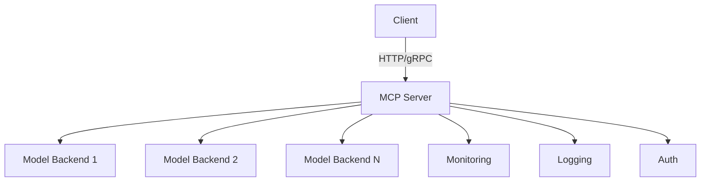

# Model Control Protocol (MCP) Overview

## What is MCP?
The Model Control Protocol (MCP) is a standardized interface for interacting with and controlling AI models, particularly large language models (LLMs). It provides a unified way to manage model inference, fine-tuning, andeployment.

## Core Concepts

### 1. Model Serving
- Unified API endpoints for model inference
- Support for multiple model backends
- Batch processing capabilities
- Streaming responses

### 2. Model Management
- Version control for models
- Model registration andiscovery
- Modelifecycle management
- Resource allocation

### 3. Monitoring & Observability
- Performance metrics
- Usage statistics
- Error tracking
- Logging and tracing

## Basic Architecture



## Getting Started

### Installation
```bash
# Install MCP server
pip install mcp-server

# Install client library
pip install mcp-client
```

### Basic Usage
```python
fromcp_client import MCPClient

# Initialize client = MCPClient(api_key="your-api-key", base_url="https://api.mcplatform.ai")

# List available models = client.list_models()
print("Available models:", models)

# Generatext
response = client.generate(
    model="gpt-4",
    prompt="Explain MCP in simple terms",
    max_tokens=150
)
print(response.text)
```

## Security Considerations
- API key management
- Rate limiting
- Input validation
- Output filtering
- Data privacy

## Resources
- [MCP Documentation](https://docs.mcplatform.ai)
- [GitHub Repository](https://github.com/mcplatform/mcp)
- [Community Forum](https://community.mcplatform.ai)
