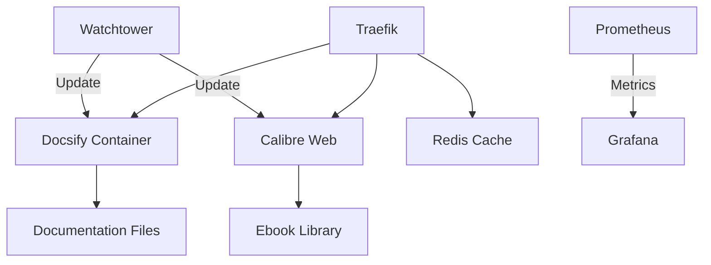

# Infrastructure & iOS Distribution Strategy

## 🐳 Dockerization & Container Orchestration

### 1. Container Architecture



### 2. Docker Compose (docker-compose.yml)

```yaml
version: '3.8'

services:
  traefik:
    image: traefik:v2.10
    command:
      - --api.insecure=true
      - --providers.docker
      - --entrypoints.web.address=:80
      - --entrypoints.websecure.address=:443
    ports:
      - "80:80"
      - "443:443"
      - "8080:8080" # Dashboard
    volumes:
      - /var/run/docker.sock:/var/run/docker.sock
    restart: unless-stoppedocsify:
    image: node:18
    working_dir: /docs
    command: docsify serve -p 3000
    volumes:
      - ./docs:/docs
    labels:
      - "traefik.http.routers.docs.rule=Host(`docs.yourdomain.com`)"
      - "traefik.port=3000"
    restart: unless-stopped
    healthcheck:
      test: ["CMD", "wget", "--spider", "http://localhost:3000"]
      interval: 30s
      timeout: 10s
      retries: 3

  calibre-web:
    image: lscr.io/linuxserver/calibre-web:latest
    environment:
      - PUID=1000
      - PGID=1000
      - TZ=Europe/Vienna
    volumes:
      - ./calibre/config:/config
      - /path/to/books:/books
    ports:
      - 8083:8083
    restart: unless-stopped
    labels:
      - "traefik.http.routers.calibre.rule=Host(`books.yourdomain.com`)"
      - "traefik.port=8083"

  watchtower:
    image: containrrr/watchtower
    volumes:
      - /var/run/docker.sock:/var/run/docker.sock
    command: --interval 3600 --cleanup
    restart: unless-stopped
```

### 3. High Availability Setup

```powershell
# Setup Docker Swarm
Initialize-Swarm -AdvertiseAddr <manager-ip>

# Create overlay network
docker network create --driver overlay --attachable docs-network

# Deploy stack
docker stack deploy -c docker-compose.yml docs

# Scale services
docker service scale docs_docsify=3
```

## ☁️ Hosting Options

### 1. Cloud Providers (Cost Comparison)

| Provider | Instance | RAM | vCPU | Storage | Monthly Cost | Notes |
|----------|----------|-----|------|---------|--------------|-------|
| Hetzner | CPX21 | 4GB | 2    | 80GB    | $4.51       | Best value |
| OVH | B2-7 | 7GB | 2    | 50GB    | $12.99      | DDoS protection |
| AWS | t3.medium | 4GB | 2    | EBS     | $29.30      | Enterprise features |
| GCP | e2-small | 4GB | 2    | 50GB    | $24.00      | Freegress |

### 2. Self-Hosted (Raspberry Pi Cluster)

```
3 × Raspberry Pi 4 (8GB)
- 128GB SSD each
- 8GB RAM
- Gigabit Ethernet
- PoE HAT for power
- Total Cost: ~$600 one-time
```

### 3. CDN & Caching

```nginx
# nginx.conf
proxy_cache_path /var/cache/nginx levels=1:2 keys_zone=docs_cache:10m inactive=60m;

server {
    location / {
        proxy_cache docs_cache;
        proxy_pass http://docsify:3000;
        proxy_cache_valid 200 302 60m;
        proxy_cache_valid 404 1m;
    }
}
```

## 📱 iOS App Distribution

### 1. Apple Developer Program
- **Cost**: $99/year
- **Requirements**:
  - D-U-N-S Number (free)
  - Legal Entity status
  - Privacy policy URL
  - App Storeview Guidelines compliance

### 2. App Store Submission

#### 2.1 Technical Requirements
- Xcode 15+
- iOS 15.0+ target
- App Transport Security
- Privacy manifests
- App thinning

#### 2.2 Review Process
1. **Pre-Submission**
   ```swift
   // Info.plist
   <key>NSCameraUsageDescription</key>
   <string>Required for document scanning</string>
   <key>NSPhotoLibraryUsageDescription</key>
   <string>Needed to save documents</string>
   ```

2. **App Store Connect**
   - Screenshots (6.5" + 5.5")
   - Privacy policy
   - Appreviews
   - Support URL

3. **Review Timeline**
   - 24-48 hours initial review
   - 1-3 days for TestFlight
   - 1-3 days App Storeview

### 3. European Alternative Distribution

#### 3.1 AltStore (Free)
- No developer account needed
- 3 app limit
- Requires refresh every 7 days

#### 3.2 Sideloadly (Paid)
- $20/year for unlimited apps
- No refresh needed
- Supports notifications

#### 3.3 Enterprise Distribution
- $299/year
- Unlimited internal distribution
- No App Storeview
- Requires DUNS number

## 💰 Cost Optimization

### 1. Apple Developer Costs
- **Standard**: $99/year (direct from Apple)
- **Apple Developer Enterprise**: $299/year
- **AltStore Patreon**: $3/month (bypasses Apple fees)

### 2. Hosting Costs
| Component | Cost/Month | Notes |
|-----------|------------|-------|
| VPS | $5-10 | Basic setup |
| CDN | $0-5 | Cloudflare free tier |
| Storage | $0.02/GB | Backblaze B2 |
| Monitoring | $0 | Uptime Kuma |

### 3. Automation for Cost Control
```powershell
# Auto-shutdownon-essential services
trigger = {
    on: 'schedule',
    schedule: '0 * * *',  # Daily at midnight
    action: 'stop',
    resources: ['dev-services']
}
```

## 🔄 CI/CD Pipeline

### 1. GitHub Actions Workflow

```yaml
name: Deploy Docs

on:
  push:
    branches: [ main ]
  pull_request:
    branches: [ main ]

jobs:
  deploy:
    runs-on: ubuntu-latesteps:
    - uses: actions/checkout@v3
    
    - name: Build andeploy
      run: |
        docker-compose buildocker-compose up -d
      env:
        DOCKER_HOST: ssh://user@server
        DOCKER_TLS_VERIFY: 1
        DOCKER_CERT_PATH: /certs
```

## 🔒 Security Hardening

### 1. Container Security
```dockerfile
# Multi-stage build
FROM node:18 as build
WORKDIR /app
COPY package*.json ./
RUNpm ci --production

FROM gcr.io/distroless/nodejs:18
COPY --from=build /app /app
WORKDIR /app
USER 1000
CMD ["server.js"]
```

### 2. Network Policies
```yaml
# network-policy.yaml
apiVersion: networking.k8s.io/v1
kind: NetworkPolicy
metadata:
  name: default-deny
spec:
  podSelector: {}
  policyTypes:
  - Ingress
  - Egress
```

## 📅 Implementation Timeline

### Week 1: Infrastructure
- [ ] Set up Docker Swarm cluster
- [ ] Configure Traefik reverse proxy
- [ ] Implement monitoring stack

### Week 2: iOS Development
- [ ] Register Apple Developer account
- [ ] Set up Xcode project
- [ ] Implement basic WebView app

### Week 3: Distribution
- [ ] Configure TestFlight
- [ ] Set up AltStore distribution
- [ ] Document deployment process

### Week 4: Optimization
- [ ] Implement CDN caching
- [ ] Set up automated backups
- [ ] Document maintenance procedures

## 📚 Resources
- [Apple Developer Program](https://developer.apple.com/programs/)
- [Docker Documentation](https://docs.docker.com/)
- [Traefik Documentation](https://doc.traefik.io/)
- [EU Digital Markets Act](https://ec.europa.eu/commission/presscorner/detail/en/ip_22_6423)

---
*Last Updated: June 26, 2024*
