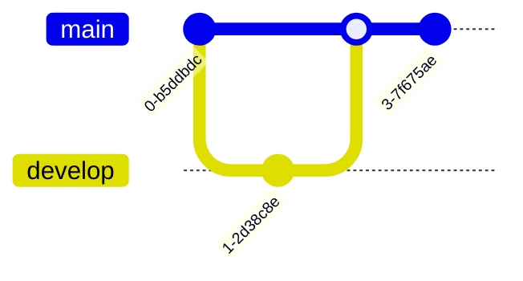

# Mermaid.js Integration - Complete Guide

## Table of Contents

- [Introduction](#introduction)
- [Installation](#installation)
- [Basiconfiguration](#basic-configuration)
- [Diagram Types](#diagram-types)
  - [Flowcharts](#flowcharts)
  - [Sequence Diagrams](#sequence-diagrams)
  - [Class Diagrams](#class-diagrams)
  - [State Diagrams](#state-diagrams)
  - [Entity Relationship Diagrams](#entity-relationship-diagrams)
  - [User Journey](#user-journey)
  - [Gantt Charts](#gantt-charts)
  - [Pie Charts](#pie-charts)
  - [Git Graph](#git-graph)
  - [C4 Diagrams](#c4-diagrams)
- [Advanced Configuration](#advanced-configuration)
  - [Themes](#themes)
  - [Custom CSS](#custom-css)
  - [API Usage](#api-usage)
  - [Accessibility](#accessibility)
- [Best Practices](#best-practices)
- [Troubleshooting](#troubleshooting)
- [Browser Support](#browser-support)
- [Performance Considerations](#performance-considerations)
- [Migration Guide](#migration-guide)
- [Contributing](#contributing)
- [License](#license)

## Introduction

Mermaid is a JavaScript-basediagramming and charting tool that renders Markdown-inspired text definitions to create and modify diagrams dynamically. It's perfect for creating documentation with embeddediagrams that are version-controlled and easy to maintain.

## Installation

### Using CDN (Recommended)

Add these scripts to your `index.html` file, after the main Docsify script:

```html
<!-- Mermaid.js -->
<script src="https://cdn.jsdelivr.net/npm/mermaid@10/dist/mermaid.min.js"></script>

<!-- Docsify Mermaid Plugin -->
<script>
  window.$docsify = {
    plugins: [
      function(hook, vm) {
        hook.doneEach(function() {
          if (window.mermaid) {
            mermaid.initialize({
              startOnLoad: false,
              theme: 'default',
              securityLevel: 'loose',
              fontFamily: '"Trebuchet MS", robot to, -apple-system, sans-serif',
              flowchart: {
                htmlLabels: true,
                useMaxWidth: true,
              },
              // Add other Mermaid config options here
            });
            mermaid.init(undefined, '.mermaid');
          }
        });
      }
    ]
  };
</script>
```

### Using npm

If you're using a build system:

```bash
npm install mermaid @mermaid-js/mermaid-mindmap --save
```

Then in your `index.html`:

```html
<script src="/path/to/mermaid.min.js"></script>
<script>
  // Initialize Mermaid with your configuration
  mermaid.initialize({
    // Configuration options
  });
</script>
```

## Basiconfiguration

Configure Mermaid in your Docsify setup:

```javascript
window.$docsify = {
  // Mermaid configuration
  mermaid: {
    // Mermaid initialization optionstartOnLoad: true,
    theme: 'default',  // or 'dark', 'forest', 'neutral'
    securityLevel: 'loose',
    
    // Common configuration for all diagrams
    themeVariables: {
      primaryColor: '#7c3aed',
      primaryTextColor: '#fff',
      primaryBorderColor: '#6d28d9',
      lineColor: '#d1d5db',
      secondaryColor: '#6b7280',
      tertiaryColor: '#f3f4f6',
      // ... other theme variables
    },
    
    // Font settings
    fontFamily: '"Trebuchet MS", robot to, -apple-system, sans-serif',
    
    // Diagram-specificonfigurations
    flowchart: {
      htmlLabels: true,
      useMaxWidth: true,
      curve: 'basis'
    },
    
    sequence: {
      diagramMarginX: 50,
      diagramMarginY: 10,
      boxMargin: 10,
      useMaxWidth: true,
      // ... other sequence diagram options
    },
    
    // Other diagram configurations...
    
    // Callback after Mermaid is loaded
    callback: function() {
      console.log('Mermaid initialized');
    }
  }
};
```

## Diagram Types

### Flowcharts are diagrams that represent workflows or processes, showing the steps as boxes of various kinds, and their order by connecting them with arrows.

````markdown
```mermaid
flowchartD
    A[Start] --> B{Is it?}
    B -- Yes --> C[OK]
    C --> D[Rethink]
    D --> B -- No --> E[End]
    
    style A fill:#f9f,stroke:#333,stroke-width:2px
    style fill:#bbf,stroke:#333,stroke-width:2px
```
````

#### Flowchart Orientation


### Sequence Diagramsequence diagramshow objects interact in a particular scenariof a use case.

````markdown

````

### Class Diagrams

Class diagrams are structure diagrams that show the classes of a system, their attributes, operations, and the relationships among objects.

````markdown

````

### State Diagramstate diagramshow the different states of an entity and how itransitions between them.

````markdown
```mermaid
stateDiagram-v2
    [*] --> Still --> [*]
    Still --> Moving --> Still
    Moving --> Crash --> [*]
    
    state "Still" as1
    state "Moving" as2 {
        state "Accelerating" as2_1
        state "Decelerating" as2_2
        state "Constant Speed" as2_3
        
        [*] --> s2_1 --> s2_3: 50% full\nofuel
        s2_3 --> s2_2: Need to stop
        s2_2 --> [*]
    }
```
````

### Entity Relationship Diagrams

ER diagrams illustrate the logical structure of databases.

````markdown

````

### User Journey

User journey diagramshow the user's journey through a system.

````markdown

````

### Gantt Charts

Gantt charts illustrate project schedules.

````markdown
```mermaid
ganttitle A Gantt Diagram
    dateFormat  YYYY-MM-DD
    section
    A task           :a1, 2023-01-01, 30d
    Another task     :after a1, 20d
    section Another
    Task in sec      :2023-01-12, 12d
    another task     :24d
```
````

### Pie Charts

Pie chartshow proportions of a whole.

````markdown

````

### Git Graph

Git-style commit diagrams.

````markdown

````

### C4 Diagrams

C4 model for visualizing software architecture.

````markdown
```mermaid
C4Contextitle System Context diagram for Internet Banking System
    
    Person(customer, "Banking Customer", "A customer of the bank, with personal bank accounts.")
    System(banking_system, "Internet Banking System", "Allows customers to view information about their bank accounts, and make payments.")
    
    Rel(customer, banking_system, "Uses")
    
    UpdateLayoutConfig($c4ShapeInRow="3")
```
````

## Advanced Configuration

### Themes

Mermaid supportseveral built-in themes:

```javascript
mermaid.initialize({
  theme: 'default',  // or 'dark', 'forest', 'neutral', 'base'
  themeVariables: {
    // Customize theme variables
    primaryColor: '#7c3aed',
    primaryTextColor: '#fff',
    primaryBorderColor: '#6d28d9',
    lineColor: '#d1d5db',
    secondaryColor: '#6b7280',
    tertiaryColor: '#f3f4f6',
    // ... other theme variables
  }
});
```

### Custom CSS

You can customize the appearance of Mermaidiagrams with CSS:

```css
/* Customermaid styles */
.mermaid {
  margin: 20px 0;
  text-align: center;
}

.mermaid .node rect,
.mermaid .node circle,
.mermaid .nodellipse,
.mermaid .node polygon {
  fill: #f8f9fa;
  stroke: #6b7280;
  stroke-width: 1.5px;
}

.mermaid .edgePath .path {
  stroke: #6b7280;
  stroke-width: 1.5px;
}

.mermaid .label {
  color: #1f2937;
  font-family: 'Segoe UI', Tahoma, Geneva, Verdana, sans-serif;
}

/* Dark theme support */
[data-theme="dark"] .mermaid .node rect,
[data-theme="dark"] .mermaid .node circle,
[data-theme="dark"] .mermaid .nodellipse,
[data-theme="dark"] .mermaid .node polygon {
  fill: #1f2937;
  stroke: #4b5563;
}

[data-theme="dark"] .mermaid .edgePath .path {
  stroke: #4b5563;
}

[data-theme="dark"] .mermaid .label {
  color: #f3f4f6;
}
```

### API Usage

You can use the Mermaid API for advanced scenarios:

```javascript
// Initialize Mermaid.initialize({
  startOnLoad: false,
  // ... other options
});

// Render a diagram from text
const diagram = `
flowchartD
    A[Start] --> B{Is it?}
    B -- Yes --> C[OK]
    C --> D[Rethink]
    D --> B -- No --> E[End]
`;

// Render to a specific element
document.addEventListener('DOMContentLoaded', function() {
  const element = document.querySelector('#mermaid-diagram');
  if (element) {
    mermaid.render('mermaid-diagram', diagram, function(svgCode) {
      element.innerHTML = svgCode;
    });
  }
});
```

### Accessibility

Make your diagrams accessible:

```javascript
mermaid.initialize({
  // Enable ARIAttributes
  accessibility: {
    text: true,
    textOnClick: true,
    skip: 'Skip diagram',
    theme: 'default'
  },
  // ... other options
});
```

## Best Practices

1. **Keep Diagrams Focused**
   - Each diagram should convey a single concept or process
   - Avoid overcrowding with too many elements
   - Use subgraphs torganize related elements

2. **Use Consistent Styling**
   - Define a consistent color scheme
   - Use the same shapes for similar concepts
   - Maintain consistent spacing and alignment

3. **Optimize foreadability**
   - Use clear, descriptive labels
   - Keep text concise but informative
   - Use whitespaceffectively

4. **Version Control**
   - Store Mermaid code in version control
   - Use meaningful commit messages when updating diagrams
   - Consider generating images foreleases

5. **Performance**
   - Limithe number of diagrams per page
   - Use simple diagrams for frequently viewed pages
   - Consider lazy-loading diagrams

## Troubleshooting

### Common Issues

1. **Diagrams Not Rendering**
   - Check browser console for errors
   - Ensure Mermaid is properly loaded
   - Verify the diagram syntax is correct

2. **Syntax Errors**
   - Check for unclosed brackets or quotes
   - Ensure proper indentation
   - Validate your Mermaid syntax

3. **Styling Issues**
   - Check for CSS conflicts
   - Verify theme variables are correctly set
   - Ensure custom styles are properly scoped

### Debugging

Enable debug mode for more detailed error messages:

```javascript
mermaid.initialize({
  logLevel: 'debug',
  securityLevel: 'loose',
  // ... other options
});
```

## Browser Support

Mermaid works in all modern browsers, including:

- Chrome (latest)
- Firefox (latest)
- Safari (latest)
- Edge (latest)
- Opera (latest)

For Internet Explorer 11, you'll need to include polyfills for:
- Promise
- Object.assign
- Array.from
- Symbol.iterator

## Performance Considerations

1. **Limit Diagram Complexity**
   - Complex diagrams can impact page load time
   - Consider splitting large diagrams into smaller ones
   - Use the `maxTextSize` option to limitext size

2. **Lazy Loading**
   - Load Mermaid only on pages that need it
   - Use the Intersection Observer API to loadiagrams when they're in view

3. **Caching**
   - Cache renderediagrams when possible
   - Consider server-side rendering for critical diagrams

## Migration Guide

### From Older Versions

1. **Version 8.x to 9.x**
   - Update initialization syntax
   - Check for breaking changes in configuration options
   - Update any custom themes or styles

2. **Fromermaid 9.x to 10.x**
   - Review the changelog for breaking changes
   - Update any deprecated API calls
   - Test all diagrams forendering issues

## Contributing

Contributions are welcome! Please follow these steps:

1. Fork the repository
2. Create a feature branch
3. Commit your changes
4. Push to the branch
5. Create a new Pull Request

## License

MIT

---

For more information, visithe [Mermaid.js documentation](https://mermaid-js.github.io/mermaid/) and the [Mermaid GitHub repository](https://github.com/mermaid-js/mermaid).
