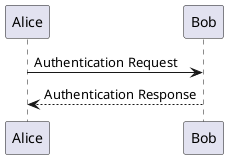
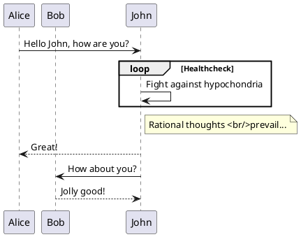
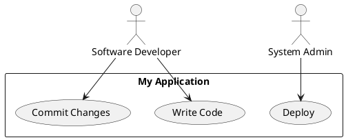
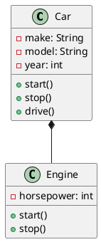
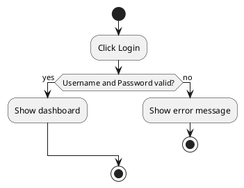

# PlantUML Plugin - Complete Guide

## Table of Contents

- [Introduction](#introduction)
- [Installation](#installation)
  - [CDN](#cdn)
  - [npm](#npm)
- [Basic Usage](#basic-usage)
  - [Simple Diagram](#simple-diagram)
  - [Different Diagram Types](#different-diagram-types)
- [Configuration](#configuration)
  - [Global Configuration](#global-configuration)
  - [Server Configuration](#server-configuration)
  - [Theme Support](#theme-support)
- [Diagram Types](#diagram-types)
  - [Sequence Diagrams](#sequence-diagrams)
  - [Use Case Diagrams](#use-case-diagrams)
  - [Class Diagrams](#class-diagrams)
  - [Activity Diagrams](#activity-diagrams)
  - [Component Diagrams](#component-diagrams)
  - [State Diagrams](#state-diagrams)
  - [Object Diagrams](#object-diagrams)
  - [Deployment Diagrams](#deployment-diagrams)
  - [Timing Diagrams](#timing-diagrams)
- [Advanced Usage](#advanced-usage)
  - [Custom Styles](#custom-styles)
  - [Error Handling](#error-handling)
  - [Performance Optimization](#performance-optimization)
  - [Accessibility](#accessibility)
- [Examples](#examples)
  - [Basic Examples](#basic-examples)
  - [Advanced Examples](#advanced-examples)
- [Troubleshooting](#troubleshooting)
- [Browser Support](#browser-support)
- [Migrating from Other Versions](#migrating-from-other-versions)
- [Contributing](#contributing)
- [License](#license)

## Introduction

The PlantUML plugin enables you to create and render UML diagrams directly in your documentation using the PlantUML syntax. It supports various diagram types including:

- Sequence diagrams
- Use case diagrams
- Class diagrams
- Activity diagrams
- Component diagrams
- State diagrams
- Object diagrams
- Deployment diagrams
- Timing diagrams

## Installation

### CDN

Add the following scripto your `index.html` file, after the main Docsify script:

```html
<!-- PlantUML plugin -->
<script src="https://cdn.jsdelivr.net/npm/docsify-plantuml@1.6.0/dist/docsify-plantuml.min.js"></script>
```

### npm

If you're using a build system:

```bash
npm install --save docsify-plantuml
```

Then include it in your project:

```javascript
import 'docsify-plantuml';
```

## Basic Usage

### Simple Diagram

Create a simple sequence diagram:

````markdown

````

### Different Diagram Types

#### Sequence Diagram

````markdown

````

#### Use Case Diagram

````markdown

````

#### Class Diagram

````markdown

````

## Configuration

### Global Configuration

```javascript
window.$docsify = {
  plantuml: {
    // Enable/disable the plugin
    enable: true,
    
    // Base URL for the PlantUML server
    // Default: 'https://www.plantuml.com/plantuml/svg/'
    server: 'https://www.plantuml.com/plantuml/svg/',
    
    // Custom CSS class for the container
    class: 'plantuml-diagram',
    
    // Defaultheme (light/dark/auto)
    theme: 'auto',
    
    // Enable/disable zoom functionality
    zoom: true,
    
    // Enable/disable copy to clipboard button
    copy: true,
    
    // Enable/disable download button
    download: true,
    
    // Enable/disablerror messageshowErrors: true,
    
    // Custom error messagerrorMessage: 'Failed to loadiagram',
    
    // Callback when diagram is loaded
    onLoad: function(diagram) {
      console.log('Diagram loaded:', diagram);
    },
    
    // Callback when error occurs
    onError: function(error) {
      console.error('Diagram error:', error);
    }
  }
};
```

### Server Configuration

You can use a self-hosted PlantUML server for better privacy and performance:

```javascript
window.$docsify = {
  plantuml: {
    // Self-hosted PlantUML server: 'https://your-plantuml-server.com/plantuml/svg/',
    
    // Optional: Add authentication headers if needed
    requestConfig: {
      headers: {
        'Authorization': 'Bearer your-token-here'
      }
    }
  }
};
```

### Theme Supporthe plugin supports light andark themes. You can configure ito automatically switch based on the system theme:

```javascript
window.$docsify = {
  plantuml: {
    theme: 'auto' // 'light', 'dark', or 'auto'
  }
};
```

## Advanced Usage

### Custom Styles

You can customize the appearance of the diagrams using CSS:

```css
/* Container */
.plantuml-diagram {
  margin: 1.5rem 0;
  border-radius: 8px;
  overflow: hidden;
  box-shadow: 0 2px 8px rgba(0, 0, 0, 0.1);
  transition: all 0.3s ease;
}

/* Toolbar */
.plantuml-toolbar {
  display: flex;
  gap: 8px;
  padding: 8px;
  background: #f8f9fa;
  border-bottom: 1px solid #eaecef;
}

/* Buttons */
.plantuml-button {
  background: #fff;
  border: 1px solid #d1d5da;
  border-radius: 4px;
  padding: 4px 8px;
  font-size: 14px;
  cursor: pointer;
  display: inline-flex;
  align-items: center;
  gap: 4px;
}

.plantuml-button:hover {
  background: #f3f4f6;
}

/* Dark theme */
[data-theme="dark"] .plantuml-toolbar {
  background: #24292e;
  border-color: #444d56;
}

[data-theme="dark"] .plantuml-button {
  background: #2d333b;
  border-color: #444c56;
  color: #adbac7;
}

[data-theme="dark"] .plantuml-button:hover {
  background: #373e47;
}
```

### Error Handling

Handlerrors gracefully with custom error messages and fallbacks:

```javascript
window.$docsify = {
  plantuml: {
    onError: function(error, container) {
      // Custom error message
      const errorDiv = document.createElement('div');
      errorDiv.className = 'plantuml-error';
      errorDiv.innerHTML = `
        <p>Failed to loadiagram</p>
        <details>
          <summary>Show error details</summary>
          <pre>${error.message}</pre>
        </details>
      `;
      
      // Replace the container content
      container.innerHTML = '';
      container.appendChild(errorDiv);
    }
  }
};
```

## Examples

### Basic Examples

#### Activity Diagram

````markdown

````

### Advanced Examples

#### Gantt Chart

````markdown
```plantuml
@startgantt
Project starts 2023-01-01
[Prototype design] as [T1] lasts 10d
[T1] is colored in LightBlue
[Development] as [T2] lasts 25d
[T2] starts at [T1]'s end
[Testing] as [T3] lasts 15d
[T3] starts at [T2]'s end
@enduml
```
````

## Troubleshooting

### Common Issues

1. **Diagrams not rendering**
   - Check the browser console for errors
   - Verify the PlantUML server URL is correct
   - Ensure there are no syntax errors in your PlantUML code

2. **Network errors**
   - Check your internet connection
   - Verify CORSettings if using a self-hosted server
   - Try a different PlantUML server

3. **Performance issues**
   - For large diagrams, consider splitting them into smaller ones
   - Use a self-hosted PlantUML server for better performance
   - Enable caching if possible

## Browser Supporthe plugin works in all modern browsers:

- Chrome (latest)
- Firefox (latest)
- Safari (latest)
- Edge (latest)
- Opera (latest)

## Migrating from Other Versions

### From v1 to v2

1. Update the plugin scripto the latest version
2. Check for breaking changes in the configuration options
3. Update any custom styles to match the new class names
4. Test all diagrams to ensure they render correctly

## Contributing

Contributions are welcome! Please follow these steps:

1. Fork the repository
2. Create a feature branch
3. Commit your changes
4. Push to the branch
5. Create a new Pull Request

## License

MIT
