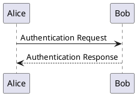
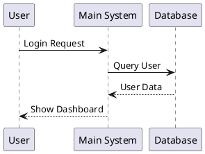
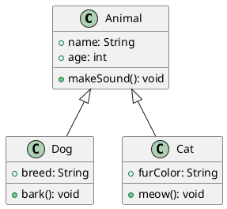
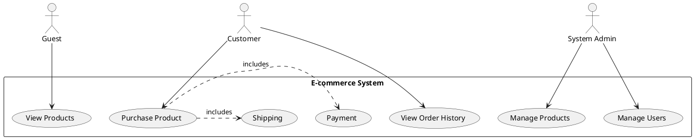
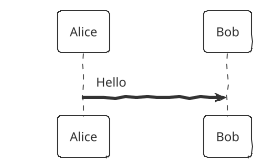
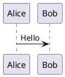

# PlantUML Plugin - Complete Guide

## Introduction

The PlantUML plugin enables you to create and render UML diagrams directly in your documentation using the PlantUML syntax. It supports various diagram types including sequence diagrams, class diagrams, use case diagrams, and more.

## Basic Usage

### Installation

```html
<!-- PlantUML plugin -->
<script src="//cdn.jsdelivr.net/npm/docsify-plantuml@1.6.0/dist/docsify-plantuml.min.js"></script>
```

### Basiconfiguration

```javascript
window.$docsify = {
  // Enable with default options
  plantuml: true
};
```

## Syntax

### Basic Diagram

````markdown

````


### Different Diagram Types

#### Sequence Diagram

````markdown

````


#### Class Diagram

````markdown

````


#### Use Case Diagram

````markdown

````


## Configuration Options

### Full Configuration

```javascript
window.$docsify = {
  plantuml: {
    // Server URL (default: https://www.plantuml.com/plantuml/svg/)
    server: 'https://www.plantuml.com/plantuml/svg/',
    
    // Image format (svg, png, txt, etc.)
    format: 'svg',
    
    // Defaultheme for diagrams
    // Available: default, sketchy, sketchy-outline
    theme: 'default',
    
    // Enable/disable diagram caching
    cache: true,
    
    // Cache duration in milliseconds (default: 1 hour)
    cacheTTL: 60 * 60 * 1000,
    
    // Enable/disable loading spinner
    showLoading: true,
    
    // Custom CSS class for the containerClass: 'plantuml-diagram',
    
    // Custom CSS class for the loading spinner
    loadingClass: 'plantuml-loading',
    
    // Custom CSS class for error messages
    errorClass: 'plantuml-error',
    
    // Callback when a diagram is rendered
    onRender: function(element, code) {
      console.log('Diagram rendered:', element);
    },
    
    // Callback when there's an error
    onError: function(element, error) {
      console.error('Diagram error:', error);
    }
  }
};
```

## Styling

### Basic Styling

```css
/* Diagram container */
.plantuml-diagram {
  margin: 1.5rem 0;
  text-align: center;
  background: white;
  border: 1px solid #e1e4e8;
  border-radius: 6px;
  padding: 1rem;
  overflow: auto;
}

/* Loading spinner */
.plantuml-loading {
  display: inline-block;
  width: 2rem;
  height: 2rem;
  border: 3px solid rgba(0, 0, 0, 0.1);
  border-radius: 50%;
  border-top-color: #0366d6;
  animation: spin 1s ease-in-out infinite;
}

@keyframespin {
  to { transform: rotate(360deg); }
}

/* Error message */
.plantuml-error {
  color: #cb2431;
  padding: 1rem;
  background-color: #ffebee;
  border-left: 4px solid #cb2431;
  margin: 1rem 0;
  font-family: monospace;
  white-space: pre-wrap;
  text-align: left;
}

/* Diagram image */
.plantuml-diagram img {
  max-width: 100%;
  height: auto;
  display: block;
  margin: 0 auto;
}

/* Dark theme support */
[data-theme="dark"] .plantuml-diagram {
  background-color: #2d2d2d;
  border-color: #444;
}

[data-theme="dark"] .plantuml-error {
  background-color: #2d1a1a;
  border-left-color: #f85149;
  color: #f85149;
}
```

## Advanced Usage

### Custom Server

You can use a self-hosted PlantUML server:

```javascript
window.$docsify = {
  plantuml: {
    server: 'https://your-plantuml-server.example.com/svg/'
  }
};
```

### Differenthemes

```javascript
window.$docsify = {
  plantuml: {
    theme: 'sketchy' // or 'sketchy-outline'
  }
};
```

### Inline Configuration

You can configure individual diagrams using HTML comments:

````markdown

````

### Custom CSS Class

Add a custom class to a specific diagram:

````markdown

````

## Best Practices

1. **Performance**
   - Use SVG format for better quality and smaller file size
   - Enable caching to reduce serverequests
   - Consider self-hosting the PlantUML server for better performance

2. **Accessibility**
   - Addescriptions for complex diagrams
   - Ensure sufficient color contrast
   - Provide alternative text when possible

3. **Maintainability**
   - Keep diagramsimple and focused
   - Use consistent styling
   - Document complex diagrams with comments

4. **Version Control**
   - Store PlantUML source code in version control
   - Generate images during build/deployment

## Troubleshooting

- **Diagrams not rendering?**
  - Check the browser console for errors
  - Verify the PlantUML server is accessible
  - Make sure the plugin is loaded after Docsify

- **Syntax errors?**
  - Check the PlantUML syntax
  - Look for unclosed blocks or invalid characters
  - Use the online PlantUML editor to test your diagram

- **Performance issues?**
  - Enable caching
  - Use a self-hosted PlantUML server
  - Optimize complex diagrams

## Example Configurations

### Minimal Configuration

```javascript
window.$docsify = {
  plantuml: true
};
```

### Custom Server and Theme

```javascript
window.$docsify = {
  plantuml: {
    server: 'https://your-plantuml-server.example.com/svg/',
    theme: 'sketchy',
    format: 'svg'
  }
};
```

### Advanced Configuration

```javascript
window.$docsify = {
  plantuml: {
    server: 'https://www.plantuml.com/plantuml/svg/',
    format: 'svg',
    theme: 'default',
    cache: true,
    cacheTTL: 24 * 60 * 60 * 1000, // 24 hourshowLoading: true,
    containerClass: 'custom-uml-container',
    loadingClass: 'custom-loading',
    errorClass: 'custom-error',
    onRender: function(element, code) {
      console.log('Diagram rendered:', element);
    },
    onError: function(element, error) {
      console.error('Failed to render diagram:', error);
    }
  }
};
```

## Additional Resources

- [PlantUMLanguage Reference Guide](https://plantuml.com/guide)
- [PlantUML Onlineditor](https://www.plantuml.com/plantuml/uml/)
- [PlantUML Cheat Sheet](https://plantuml.com/cheat-sheet)
- [PlantUML Server](https://plantuml.com/server)

---

For more information, visithe [docsify-plantuml GitHub repository](https://github.com/imyelo/docsify-plantuml).
