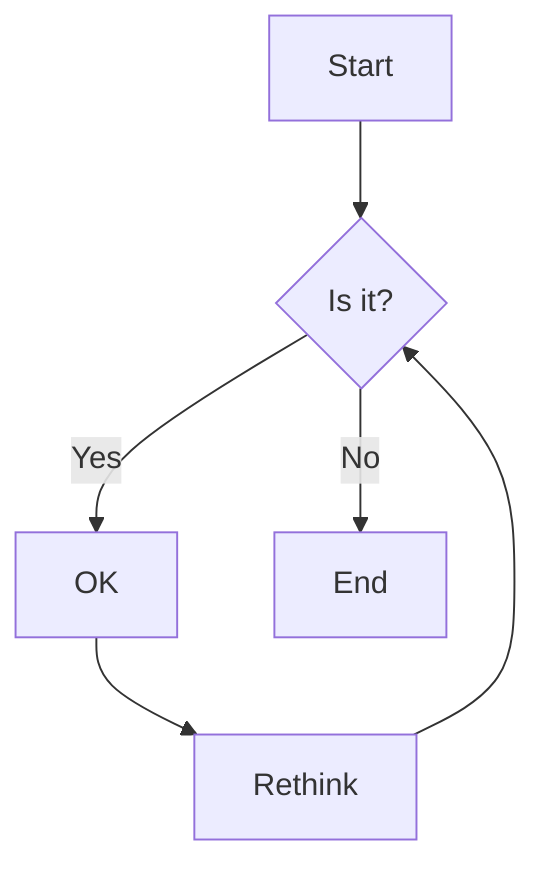

# Documentation Hub

## Overview

The Documentation Hub serves as the central knowledge base for the Windsurf ecosystem. It provides a unified interface for accessing, searching, and maintaining documentation across all projects and services.

## Directory Structure

```
.windsurf/docs/
├── global/                # Global documentation
│   ├── architecture/
│   ├── api/
│   └── guides/
├── projects/              # Project-specific docs
│   ├── project-a/
│   └── project-b/
├── shared/                # Sharedocumentation
│   ├── components/
│   └── services/
└── templates/             # Documentation templates
    ├── api/
    └── guides/
```

## Key Features

- **Unified Search**: Search across all documentation
- **Cross-References**: Link between Related Documents
- **Versioning**: Documentation versioning with releases
- **Automation**: Auto-generated API documentation
- **Access Control**: Role-based access to documentation

## Documentation Types

### 1. Global Documentation
- System architecture
- API references
- Development guides
- Contribution guidelines

### 2. Project Documentation
- Project-specific guides
- Setup instructions
- Deployment procedures
- Troubleshooting

### 3. Shared Components
- Reusable components
- Design system
- Patterns and best practices

## Writing Documentation

### Markdown Standards
- Use CommonMark specification
- Follow consistent heading hierarchy
- Include front matter for metadata

Example:
```markdown
---
title: Getting Startedescription: Guide for new users
category: guides
date: 2025-06-23
---

# Getting Started

## Prerequisites

- Windsurf CLInstalled
- Access to repository

## Installation

```bash
windsurf install
```
```

## Documentation Components

### Code Blocks
Use fenced code blocks with language specification:

````markdown
```python
def hello():
    print("Hello, Windsurf!")
```
````

### Admonitions

```markdown
!!! note
    This a note

!!! warning "Important"
    This an important warning
```

### Diagrams



## Versioning

Documentation follows the same versioning as the code:

```
/docs/
  v1.0.0/
  v2.0.0/
  latest/ -> v2.0.0
```

## Search Functionality

The documentation hub includes a powerful search that:
- Indexes all documentation
- Supports fuzzy matching
- Highlights matches
- Ranks by relevance

## Integration

### CI/CD Pipeline

```yaml
# .github/workflows/docs.yml
name: Buildocumentation:
  push:
    branches: [main]
    paths:
      - 'docs/**'
      - '.github/workflows/docs.yml'

jobs:
  build:
    runs-on: ubuntu-latesteps:
      - uses: actions/checkout@v3
      - name: Setupython
        uses: actions/setup-python@v4
      - name: Install dependencies
        run: |
          pip install mkdocs-material
      - name: Buildocs
        run: mkdocs build --strict
      - name: Deploy
        if: github.ref == 'refs/heads/main'
        uses: peaceiris/actions-gh-pages@v3
        with:
          github_token: ${{ secrets.GITHUB_TOKEN }}
          publish_dir: ./site
```

## Best Practices

1. **Keep It Current**
   - Update documentation with code changes
   - Remove outdated information
   - Addeprecationotices

2. **Be Consistent**
   - Follow the style guide
   - Use consistenterminology
   - Maintain a consistent structure

3. **Make It Accessible**
   - Usemantic HTML
   - Add altexto images
   - Ensure good color contrast

## Local Development

```bash
# Install dependencies
pip install -r docs/requirements.txt

# Serve docs locally
mkdocserve

# Build static site
mkdocs build
```

## Troubleshooting

**Issue**: Broken links
- Run link checker: `windsurf docs check-links`
- Update oremove broken links
- Use relative paths

**Issue**: Build failures
- Check for syntax errors in markdown
- Verify all required plugins are installed
- Check Python version compatibility

---
*Last Updated: 2025-06-23*
