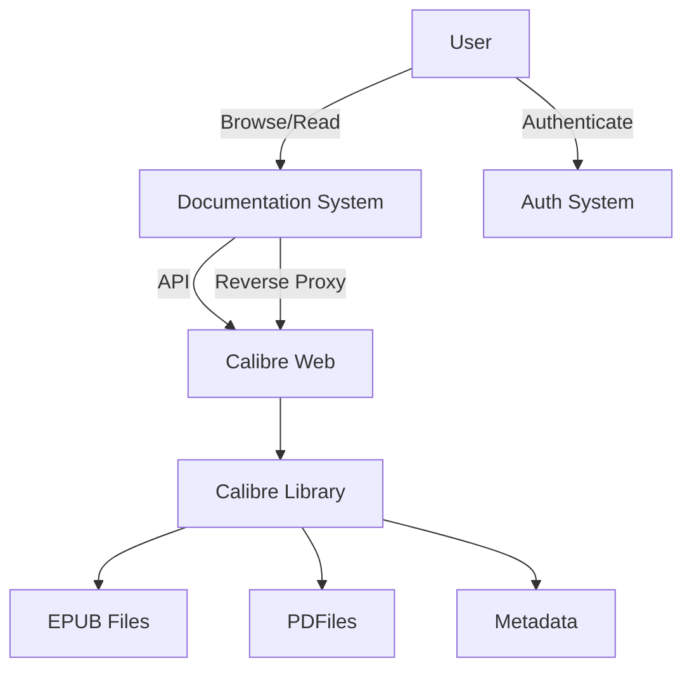

# Ebook Library Integration Plan

## 📚 Overview

This document outlines the strategy for integrating a comprehensive ebook and academic paper library into the documentation system using Calibre Web. The solution will provide seamless access to a vast collection of ebooks (EPUB, PDF) and academic papers while maintaining thexisting documentation structure.

## 🎯 Objectives

1. Provide unified access to ebooks and academic papers within the documentation
2. Maintain existing Calibre library structure and metadata
3. Enable both web-based reading andownloads
4. Implement robust search and categorization
5. Ensure security and access control
6. Maintain performance with large collections

## 🏗️ System Architecture



## 🛠️ Components

### 1. Calibre Web Server
- **Purpose**: Servebooks and handle metadata
- **Port**: 8083 (configurable)
- **Features**:
  - Web-based interface
  - OPDSupport
  - User authentication
  - Metadata management

### 2. Documentation Integration
- **Location**: `/resources/ebooks` in docs
- **Components**:
  - Dynamic book listings
  - Search interface
  - Category pages
  - API endpoints for metadata

### 3. Authentication Layer
- **Options**:
  - Basic Auth
  - OAuth2 (if needed)
  - IP whitelisting

## 📋 Implementation Phases

### Phase 1: Setup & Configuration (Week 1)

1. **Calibre Web Installation**
   ```powershell
   # Install required Python packages
   pip install calibre-web
   
   # Create startup script (start-calibre.ps1)
   @"
   $env:CALIBRE_DB_PATH = "D:\Path\To\Calibre\Library"
   $env:CALIBRE_PORT = 8083
   cwp --port $env:CALIBRE_PORT --max-cover 300x400 --enable-local-write
   "@ | Out-File -FilePath "start-calibre.ps1" -Encoding utf8
   ```

2. **Library Configuration**
   - Set up library path
   - Configure metadata fetching
   - Set up initial admin account

3. **Test Access**
   - Verify web interface at `http://localhost:8083`
   - Test book uploads and metadata fetching

### Phase 2: Documentation Integration (Week 2)

1. **Createbook Portal**
   - Add main ebook landing page
   - Create category pages
   - Implement search functionality

2. **Dynamicontent Generation**
   - PowerShell scripto generate markdown from Calibre metadata
   - Scheduled task for updates

3. **UI Components**
   - Book cards
   - Reading interface
   - Download options

### Phase 3: Advanced Features (Week 3)

1. **Search Integration**
   - Full-text search across library
   - Filter by metadata
   - Recent additions

2. **User Experience**
   - Reading progress tracking
   - Bookmarks
   - Dark mode foreader

3. **Performance Optimization**
   - Caching strategy
   - Lazy loading
   - Asset optimization

## 🔧 Technical Details

### File Structure
```
docs/
├── 5_development/
│   └── integrations/
│       └── ebook_library/
│           ├── scripts/           # PowerShell scripts
│           ├── templates/         # HTML/Markdown templates
│           └── config/            # Configuration files
└── resources/
    └── ebooks/               # Generated content
        ├── all.md
        ├── philosophy/
        ├── science/
        └── technology/
```

### API Endpoints

| Endpoint | Method | Description |
|----------|--------|-------------|
| `/api/books` | GET | List all books |
| `/api/books/{id}` | GET | Get book details |
| `/api/books/search` | GET | Search books |
| `/api/books/{id}/read` | GET | Read book online |
| `/api/books/{id}/download` | GET | Download book |

## 🔄 Automation

### Metadata Sync Script
```powershell
# sync-ebooks.ps1
$calibreDb = "D:\Path\To\Calibre\metadata.db"
$outputDir = "$PSScriptRoot\..\..\resources\ebooks"

# Ensure output directory exists
if (-not (Test-Path $outputDir)) {
    New-Item -ItemType Directory -Path $outputDir -Force
}

# Query Calibre database and generate markdown
# This a simplified example
$books = sqlite3 -json $calibreDb @"
SELECT 
    b.id,
    b.title,
    b.authors,
    b.pubdate,
    b.timestamp,
    b.comments,
    GROUP_CONCAT(d.format) as formats
FROM books b
LEFT JOIN data d ON b.id = d.book
GROUP BY b.id
"@ | ConvertFrom-Json

# Generate all books page
@"
# 📚 All Books

| Title | Author | Year | Formats |
|-------|--------|------|----------|
"@ | Out-File -FilePath "$outputDir\all.md" -Encoding utf8 -Force

# Process each book
foreach ($book in $books) {
    $bookId = $book.id
    $formats = $book.formats -split ','
    
    # Add to all books list
    "| [$($book.title)](/resources/ebooks/books/$bookId) | $($book.authors) | $($book.pubdate) | $($formats -join ', ') |" | 
        Out-File -FilePath "$outputDir\all.md" -Append -Encoding utf8
    
    # Generate individual book page
    $bookDir = "$outputDir\books"
    if (-not (Test-Path $bookDir)) {
        New-Item -ItemType Directory -Path $bookDir -Force
    }
    
    @"
# $($book.title)

**Author**: $($book.authors)  
**Published**: $($book.pubdate)

## Description
$($book.comments)

## Download
$($formats | ForEach-Object { "- [$_ Format](/calibre/get/$bookId/$_)" })

[🔙 Back to Library](/resources/ebooks)
"@ | Out-File -FilePath "$bookDir\$bookId.md" -Encoding utf8 -Force
}
```

### Scheduled Task
```powershell
# Create scheduled task to run daily
$action = New-ScheduledTaskAction -Execute "PowerShell.exe" -Argument `
    "-NoProfile -ExecutionPolicy Bypass -File \"D:\path\to\sync-ebooks.ps1\""
$trigger = New-ScheduledTaskTrigger -Daily -At "2am"
Register-ScheduledTask -TaskName "Updatebook Library" -Action $action -Trigger $trigger
```

## 🔒 Security Considerations

1. **Authentication**
   - Secure adminterface
   - Rate limiting
   - CSRF protection

2. **Access Control**
   - Role-based access
   - IP restrictions
   - Secure file serving

3. **Data Protection**
   - Regular backups
   - Encryption at rest
   - Secure file uploads

## 📊 Monitoring & Maintenance

### Logging
- Access logs
- Error tracking
- Usage analytics

### Backup Strategy
```powershell
# backup-library.ps1
$source = "D:\Path\To\Calibre\Library"
$dest = "Z:\Backups\Calibre"
$date = Get-Date -Format "yyyyMMdd"
$backupFile = "$dest\calibre_library_$date.zip"

# Create backup directory if it doesn't exist
if (-not (Test-Path $dest)) {
    New-Item -ItemType Directory -Path $dest -Force
}

# Create zip backup
Compress-Archive -Path $source -DestinationPath $backupFile -CompressionLevel Optimal

# Keep only last 30 days of backups
Get-ChildItem -Path "$dest\calibre_library_*.zip" | 
    Sort-Object CreationTime -Descending | 
    Select-Object -Skip 30 | 
    Remove-Item -Force
```

## 📅 Timeline

| Phase | Tasks | Duration | Status |
|-------|-------|----------|--------|
| 1 | Setup & Configuration | 1 week | Not Started |
| 2 | Documentation Integration | 1 week | Not Started |
| 3 | Advanced Features | 1 week | Not Started |
| 4 | Testing & Optimization | 3 days | Not Started |
| 5 | Deployment | 2 days | Not Started |

## 📝 Next Steps

1. [ ] Set up Calibre Web server
2. [ ] Configure library path and permissions
3. [ ] Create documentation pages
4. [ ] Implement search functionality
5. [ ] Set up authentication
6. [ ] Test with sample data
7. [ ] Deploy to production

## 📚 Resources

- [Calibre Web Documentation](https://github.com/janeczku/calibre-web)
- [Calibre Command Line Interface](https://manual.calibre-ebook.com/generated/en/cli-index.html)
- [OPDSpecification](https://specs.opds.io/)

---
*Last Updated: June 26, 2024*
