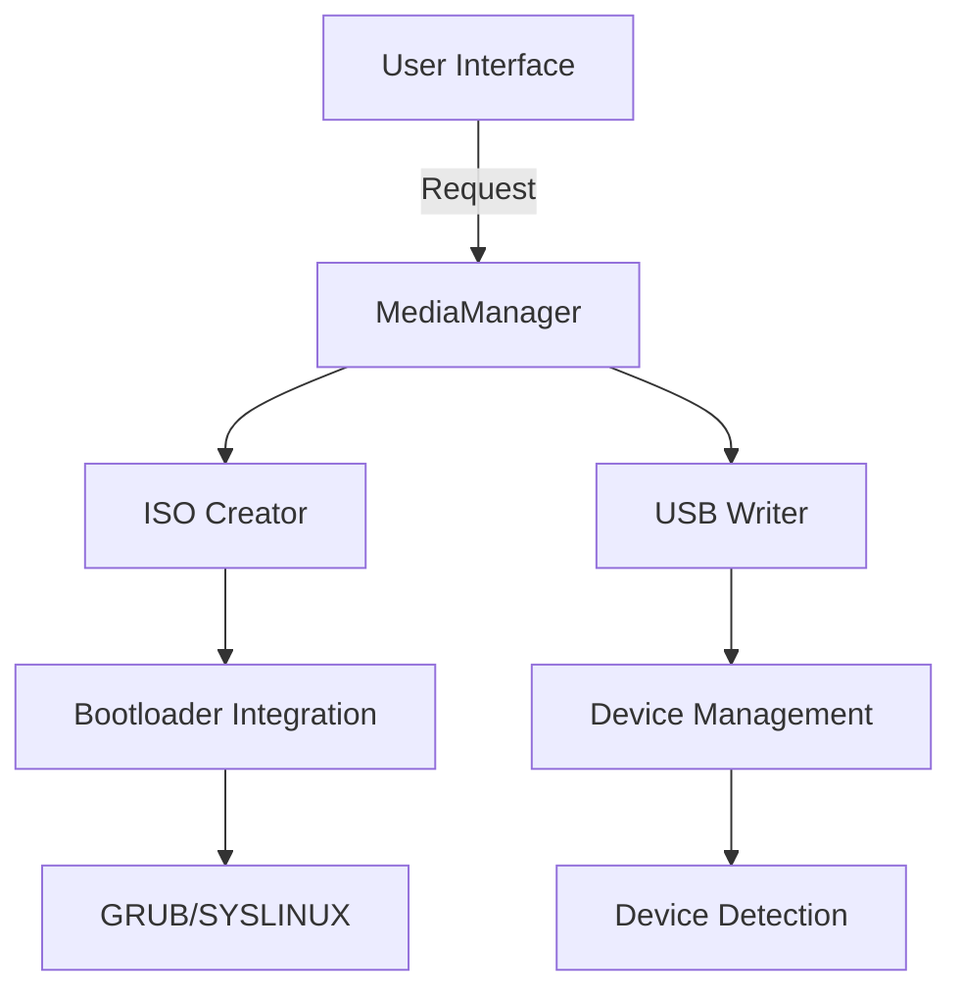

# Bootable Media Technical Specification

## 1. Introduction
This document outlines the technical specifications for implementing bootable media creation in virtualization-mcp, including ISO creation and USB boot media preparation.

## 2. Requirements

### 2.1 Functional Requirements
- Create bootable ISOs from directories
- Write ISOs to USB devices
- Support multiple bootloaders (GRUB, SYSLINUX, etc.)
- Validate boot media
- Show progress during operations
- Cross-platform support (Windows, Linux, macOS)

### 2.2 Non-Functional Requirements
- Security: Verify checksums, validate inputs
- Performance: Efficient handling of large files
- Usability: Clear error messages, progress feedback
- Portability: Work across different OS environments

## 3. System Architecture



## 4. API Specification

### 4.1 MediaManager Class
```python
class MediaManager:
    def create_iso(
        self,
        source_dir: str,
        output_path: str,
        bootloader: str = 'grub',
        volume_id: str = 'VBOX_BOOT',
        file_system: str = 'iso9660',
        joliet: bool = True,
        rock_ridge: bool = True
    ) -> str:
        """Create a bootable ISO."""
        pass
    
    def write_to_usb(
        self,
        iso_path: str,
        device: str,
        force: bool = False,
        verify: bool = True
    ) -> bool:
        """Write ISO to USB device."""
        pass
    
    def list_devices(self) -> List[Dict[str, Any]]:
        """List available USB devices."""
        pass
```

### 4.2 Bootloader Integration
- **GRUB2**: Default bootloader with configurable menu
- **SYSLINUX**: Alternative for simple boot menus
- **Custom**: Allow custom bootloader configurations

## 5. Implementation Details

### 5.1 Dependencies
- `pycdlib`: For ISO manipulation
- `psutil`: For device detection
- `tqdm`: For progress bars
- Platform-specific tools:
  - Windows: `diskpart`
  - Linux: `dd`, `lsblk`
  - macOS: `diskutil`

### 5.2 Security Considerations
- Verify ISO checksums
- Validate file permissions
- Sanitize user inputs
- Implement proper error handling
- Secure temporary file handling

## 6. Testing Strategy

### 6.1 Unit Tests
- ISO creation with various parameters
- Device detection
- Bootloader configuration

### 6.2 Integration Tests
- End-to-end media creation
- Cross-platform compatibility
- Error scenarios

### 6.3 Manual Testing
- Boot media on different systems
- Various hardware configurations
- Edge cases

## 7. Future Enhancements
- Support for UEFI boot
- Network boot (PXE) support
- Custom boot menu creation
- Automated testing in virtual environments


